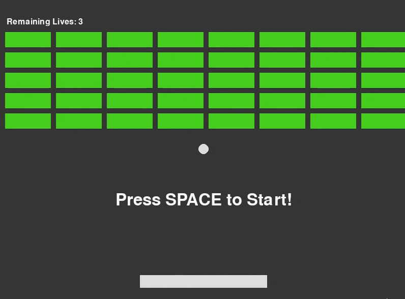

### Python Game Development
- For this class, I had to build three games. The first was a tile breakaway game including basic simulated physics like acceleration and friction. The second game was a tower defense that used a custom map I made with tiled and sprites as well as touching heavily on collisions and other common game mechanics. The final game was a sprite hack and slash with another custom map that involves multiple player actions and corresponding animations. The games themselves are not particularly complex or fun as there purpose was to learn basic concepts, but they met the class requirements and I literally completed them all in about a week  :P 

#### Break Away Game

#### Tower Defense

#### Sprite Game
